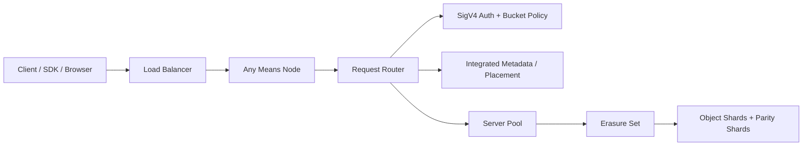

# Means

> Means 是一个面向应用文件与静态资源场景的、架构优先的自建分布式对象存储项目。

Means 当前处于设计与引导阶段。仓库目前只有一个最小化的 ASP.NET Core 服务宿主；本 README 用于定义 v1 的公开兼容契约与后端架构基线，而不是宣称这些能力都已经实现。

## 项目状态

- 开源协议：MIT
- 运行时基线：ASP.NET Core `net10.0`
- 当前仓库状态：仅包含 bootstrap host，尚未实现对象存储数据面
- v1 目标：提供面向自建部署的 S3-compatible 核心 bucket/object API
- 默认部署假设：单逻辑 Region、单站点、可水平扩展集群

## 项目目标

Means 希望为以下场景提供清晰、稳定的对象存储基础设施：

- 应用上传文件
- 静态资源分发
- 内部文件平台
- 自建 S3-compatible 存储服务

第一阶段的范围刻意收窄：先把标准化文件管理协议、桶设计、对象读写语义和分布式后端架构打稳，再逐步扩展到更复杂的生产能力。

## 设计原则

- 先对齐 S3-compatible 数据面，而不是发明一套私有对象协议。
- 任意节点都可以在负载均衡后接收任意请求。
- bucket 默认遵守 DNS-compatible 命名规则，同时支持 virtual-hosted-style 与 path-style 两种寻址。
- 对象写入保持原子提交：`PutObject` 成功就表示完整对象已提交。
- 压缩是传输层能力，不改变存储中的原始对象。
- 元数据、策略和数据放置由集群内建控制面负责，v1 不默认依赖外部元数据数据库。

## 当前仓库

当前代码库只是一个最小化的 ASP.NET Core 服务宿主。还没有 bucket、object、policy、metadata 或分布式存储内核的实现代码。现阶段仓库主要用于固定：

- v1 兼容边界
- 后端拓扑与术语
- 后续实现的开发基线

本地命令：

```bash
dotnet restore Means.slnx
dotnet build Means.slnx
dotnet run --project src/Means/Means.csproj
```

## v1 兼容契约

Means v1 只承诺一组聚焦的 Amazon S3 对象 API 子集。下面的内容描述的是目标公开契约，不等同于当前仓库已经具备完整实现。

### 支持的 API 范围

| 能力 | S3 风格操作 | 请求形态 | 目标行为 |
| --- | --- | --- | --- |
| bucket 列表 | `ListBuckets` | `GET /` | 返回与 S3 风格兼容的 XML bucket 列表 |
| 创建 bucket | `CreateBucket` | `PUT /{bucket}` | 使用 DNS-compatible 规则创建 bucket |
| bucket 元数据 | `HeadBucket` | `HEAD /{bucket}` | 返回 bucket 是否存在/是否可访问，不返回 body |
| 删除 bucket | `DeleteBucket` | `DELETE /{bucket}` | 删除空 bucket |
| object 列表 | `ListObjectsV2` | `GET /{bucket}?list-type=2` | 返回支持 `prefix`、`delimiter`、continuation 的 S3 风格 XML 列表 |
| 上传 object | `PutObject` | `PUT /{bucket}/{key}` | 原子写入对象，并返回对象身份相关响应头 |
| 下载 object | `GetObject` | `GET /{bucket}/{key}` | 以流方式返回对象 body 和标准元数据/Range 响应头 |
| 查询 object 元数据 | `HeadObject` | `HEAD /{bucket}/{key}` | 不返回 body，只返回对象元数据响应头 |
| 删除 object | `DeleteObject` | `DELETE /{bucket}/{key}` | 删除当前对象 |
| 服务端复制 | `CopyObject` | `PUT /{bucket}/{key}` + `x-amz-copy-source` | 从现有 source object 复制出 destination object |
| 临时访问 | Presigned `GET` / `PUT` | 查询参数签名 URL | 提供有时效的直传/直读能力 |

### 明确不属于 v1 的范围

- `multipart upload`
- bucket versioning
- lifecycle management
- cross-site replication
- event notification
- object locking / retention
- 管理控制台
- 完整 IAM / STS 角色体系

### 响应格式约定

- 列表接口与错误响应使用 S3 风格 XML envelope。
- 对象读取接口返回原始流加 HTTP 元数据响应头。
- `HEAD` 在元数据契约上与 `GET` 对齐，但不返回 body。
- v1 默认只支持 Signature Version 4（`SigV4`）。

## Bucket 设计与访问地址

Means 同时支持两种标准 S3 寻址方式。

### 推荐方式：virtual-hosted-style

```text
https://{bucket}.means.local/{key}
```

示例：

```text
https://static-assets.means.local/app/main.js
```

### 兼容方式：path-style

```text
https://api.means.local/{bucket}/{key}
```

示例：

```text
https://api.means.local/static-assets/app/main.js
```

### 寻址规则

- virtual-hosted-style 是生产环境推荐默认值。
- path-style 继续保留，用于兼容和本地开发。
- virtual-hosted-style 需要 `*.means.local` 的 wildcard DNS 与 TLS 证书。
- 所有 bucket/object 操作都必须能通过两种寻址方式访问。
- object `prefix` 通过 object key 中的 `/` 自动推导，中间目录不是一等资源。

### Bucket 命名规则

为了兼容常见 S3 客户端，Means 默认采用 DNS-compatible bucket 命名规则：

- 长度为 3 到 63 个字符
- 只允许小写字母、数字、连字符（`-`）和点（`.`）
- 必须以字母或数字开头和结尾
- 不能看起来像 IPv4 地址
- 不能包含相邻的两个点

## 访问控制模型

Means v1 的鉴权和授权模型有意保持克制：

- 使用 `AccessKey/SecretKey` 处理已认证请求
- 使用 Signature Version 4（`SigV4`）进行请求签名和预签名 URL 生成
- 使用 bucket policy 进行 allow/deny 决策
- 在 bucket policy 显式授权时支持匿名只读
- 支持 presigned `GET` 与 presigned `PUT`

这使 Means 在第一阶段即可兼容常见 S3 SDK 与工具链，同时避免过早引入完整 IAM/STS 设计。

## 对象读取契约

`GetObject` 与 `HeadObject` 是 Means 面向应用和静态资源分发的核心文件服务接口。

### 计划支持的响应头

| 响应头 | v1 约定 |
| --- | --- |
| `ETag` | 对象身份标识，读写接口均可返回 |
| `Last-Modified` | 对象最后修改时间 |
| `Content-Length` | 当前响应表示的编码后长度 |
| `Content-Type` | 对象媒体类型 |
| `Accept-Ranges` | 声明支持字节范围读取 |
| `Cache-Control` | 当对象携带该元数据时透传返回 |
| `Content-Disposition` | 当对象携带该元数据时透传返回 |
| `Content-Encoding` | 当发生协商压缩时返回 |
| `x-amz-meta-*` | 用户自定义元数据透传 |
| `x-amz-request-id` | 请求级追踪标识 |
| `x-amz-id-2` | 次级请求追踪标识 |
| `x-amz-version-id` | 为未来版本控制保留，v1 不保证返回 |

### 读取响应示例

```http
HTTP/1.1 200 OK
ETag: "7f6df3cc29f8b30f0cf4f7f7c132d7e3"
Last-Modified: Thu, 07 May 2026 16:00:00 GMT
Content-Length: 41218
Content-Type: application/javascript
Accept-Ranges: bytes
Cache-Control: public, max-age=31536000, immutable
Content-Encoding: br
Vary: Accept-Encoding
x-amz-request-id: 6B4A8E2C8A5C4F2D
x-amz-id-2: n3n62b4e9b0d1ef2c3a4c5d6e7f809ab
x-amz-meta-origin: web-build
```

## 静态文件自动压缩

Means 将压缩视为对象读取阶段的内容协商能力。

### 交付规则

- 存储中的原始对象保持不变。
- 客户端通过 `Accept-Encoding` 声明支持的编码方式。
- Means 可对可压缩内容类型返回 `gzip` 或 `br`。
- 一旦发生协商压缩，响应必须带 `Content-Encoding` 与 `Vary: Accept-Encoding`。
- PNG 这类原生已压缩格式不再二次压缩。
- 很小的对象可按实现阈值跳过压缩。
- v1 默认对 Range `GET` 关闭压缩，避免字节范围与压缩表示混用。

### 典型适用内容

- JavaScript bundle
- CSS
- HTML
- JSON
- SVG
- 各类文本响应

## 后端架构基线

Means 的目标是一个内建控制面的分布式对象存储集群，而不是套在任意后端上的薄网关。



### 集群模型

- 客户端通过负载均衡连接到任意 Means 节点。
- 接入节点负责完成鉴权、bucket/object 路由和存储访问编排。
- bucket 元数据、访问策略与数据放置规则由 Means 集群内建控制面维护。
- `server pool` 是容量扩展单位。
- `erasure set` 是对象放置与恢复的耐久性单位。

### 存储语义

- `PutObject` 对客户端呈现为原子提交。
- `prefix` 是 object key 的逻辑分组，不是目录实体。
- v1 默认部署模型为单站点、单逻辑 Region。
- 后续可以在不推翻对象 API 形态的前提下演进到 healing/scrub、在线扩容和更复杂的数据管理能力。

## 标准文件管理协议说明

Means 的文件管理协议刻意复用开发者已经熟悉的 S3 行为模型。

- bucket 是顶层存储命名空间。
- object 通过 bucket 内的完整 key 寻址。
- `prefix` 过滤与 `delimiter` 列表是对象枚举的一等能力。
- `CopyObject` 遵循 S3 约定，通过写入目标 object 并附带 `x-amz-copy-source` 请求头完成。
- 错误处理预期使用标准 HTTP 状态码加 S3 风格 XML error code，例如 `NoSuchBucket`、`NoSuchKey`、`AccessDenied`、`InvalidRange`。

## 请求示例

path-style 读取 object：

```bash
curl -i "https://api.means.local/static-assets/app/main.js"
```

virtual-hosted-style 读取 object：

```bash
curl -i "https://static-assets.means.local/app/main.js"
```

按 prefix 列出 object：

```bash
curl -i "https://api.means.local/static-assets?list-type=2&prefix=app/&delimiter=/"
```

预签名上传：

```bash
curl -X PUT --upload-file ./main.js "https://static-assets.means.local/app/main.js?X-Amz-Algorithm=AWS4-HMAC-SHA256&..."
```

匿名读取启用公开策略的 bucket：

```bash
curl -i "https://public-assets.means.local/logo.svg"
```

## Roadmap

在 v1 核心契约稳定后，Means 预计继续推进：

- multipart upload
- bucket versioning
- lifecycle rules
- cross-site replication
- healing / scrub 工作流
- 管理 API
- 运维控制台

## 参与贡献

在当前阶段，架构讨论与协议评审比功能 PR 更有价值。尤其欢迎围绕以下主题提出 issue 或设计建议：

- API 兼容边界
- bucket 与 object 语义
- 压缩行为
- 集群拓扑与故障处理

## 参考资料

- [Amazon S3 REST API](https://docs.aws.amazon.com/AmazonS3/latest/API/RESTAPI.html)
- [Amazon S3 GetObject API](https://docs.aws.amazon.com/AmazonS3/latest/API/API_GetObject.html)
- [Amazon S3 Common Response Headers](https://docs.aws.amazon.com/AmazonS3/latest/API/RESTCommonResponseHeaders.html)
- [Amazon S3 Bucket Naming Rules](https://docs.aws.amazon.com/AmazonS3/latest/userguide/bucketnamingrules.html)
- [MinIO Objects and Versioning](https://docs.min.io/aistor/administration/objects-and-versioning/)
- [MinIO Erasure Coding](https://docs.min.io/aistor/operations/core-concepts/erasure-coding/)
- [MinIO Healing](https://docs.min.io/aistor/operations/core-concepts/healing/)
- [ASP.NET Core Response Compression](https://learn.microsoft.com/en-us/aspnet/core/performance/response-compression?view=aspnetcore-10.0)

## License

Means 采用 MIT License 发布，详见 [LICENSE](LICENSE)。
