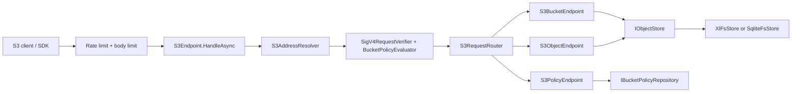

# 架构总览

Means 的主服务在 `src/Means`，通过 ASP.NET Core 同时承载 S3-compatible 数据面、Console 管理面、静态 Web 控制台、Prometheus 指标和后台任务。核心设计目标是让协议层、存储层、管理层和 SDK 合约彼此解耦，使后续替换元数据后端或扩展分布式能力时不破坏 S3 API 与 SDK 语义。

## 解决方案分层

| 层级 | 路径 | 职责 |
| --- | --- | --- |
| Host/Service | `src/Means` | 组合依赖注入、中间件、S3 endpoint、Console API、metrics、后台任务、认证和静态站点 |
| Core | `src/Means.Core` | 定义 bucket/object/upload/version/cluster/audit/task 等模型和抽象接口 |
| Protocol | `src/Means.Protocol.S3` | S3 地址解析、SigV4 header/query 签名校验、S3 XML 序列化、压缩协商、命名校验 |
| XlFs Storage | `src/Means.Infrastructure.XlFs` | 默认后端，多盘对象文件布局、`MeansLogDb` 元数据、replica manifest、repair、GC、cluster maintenance |
| SqliteFs Storage | `src/Means.Infrastructure.SqliteFs` | legacy/test adapter，SQLite metadata + filesystem blob，用于测试和兼容验证 |
| Console UI | `web` | React/Vite 控制台，构建后作为静态资源由 `src/Means` 提供 |
| Docs Site | `docs-site` | Next/Fumadocs 风格文档站点，当前为未跟踪目录，不属于主构建链路 |
| SDKs | `SDKs` | C#、浏览器 TypeScript、Node TypeScript SDK，以及 SDK 合同规范 |
| Tests | `tests` | Unit、Integration、Contract 测试 |

## 服务启动链路

`Program.cs` 保持轻量：

1. `AddMeansDataPlane` 注册配置、存储后端、认证、限流、Telemetry、核心服务和后台任务。
2. 使用 Cookie Authentication 支撑 Console 管理面。
3. 启用 API rate limit、Console API 错误转换、请求体大小限制。
4. 映射 `/api/console` 管理面、`/metrics` 指标端点和 S3 数据面。
5. 最后 fallback 到 Web 控制台静态页面。

核心组合点在 `src/Means/Composition/MeansDataPlaneServiceCollectionExtensions.cs`。它按配置绑定以下区域：

- `Means:S3` -> `S3AddressingOptions`
- `Means:Storage` -> `SqliteFsOptions` 和 `XlFsOptions`
- `Means:Cluster` -> `ClusterOptions`
- `Means:Console` -> `ConsoleOptions`
- `Means:RequestLimits` -> `RequestLimitsOptions`
- `Means:RateLimits` -> `MeansRateLimitOptions`
- `Means:Telemetry` -> `TelemetryOptions`

## 数据面请求链路

数据面以 catch-all 路由承接 S3 请求。S3 并不是传统 REST 控制器风格，而是由 method、host、path、query subresource 和 header 共同决定语义，因此 `S3EndpointRouteBuilderExtensions` 注册：

- `/s3/{**path}`：同源别名前缀，适合单域名部署和 Console 浏览器上传。
- `/{**path}` + `RequireHost(serviceHost, *.domainSuffix)`：标准 path-style 和 virtual-hosted-style 域名。

进入 `S3Endpoint` 后，流程固定为：地址解析 -> SigV4 或匿名 policy 验证 -> 按 service/bucket/object/policy 子资源分发 -> 调用 Core 抽象 -> 写回 S3 XML 或对象流响应。

## 管理面请求链路

Console API 在 `/api/console`，使用 Cookie session，与 S3 access key/secret key 分离。管理面覆盖：

- 登录、登出、会话检查。
- Bucket、对象浏览、对象详情、复制、删除。
- Bucket settings、versioning、lifecycle、policy。
- Console 生成 presigned upload/download URL。
- Multipart 浏览器上传辅助接口。
- Access key 管理。
- 系统设置、审计日志、dashboard stats。
- Cluster、diagnostics、EC profiles、后台任务手动触发。

管理面异常通过 `ConsoleApiExceptionMiddleware` 转换为 JSON，S3 数据面错误保持 XML，以避免客户端协议混淆。

## 核心抽象

| 抽象 | 主要用途 |
| --- | --- |
| `IObjectStore` | Bucket/Object/Multipart/Versioning/Lifecycle/CORS/Notification 的数据面能力 |
| `IAccessKeyStore` | SigV4 access key 查找 |
| `IBucketPolicyRepository` | Bucket policy 持久化与读取 |
| `IConsoleStore` | Console dashboard、settings、audit、access key、bucket usage |
| `IClusterStore` | 节点、磁盘、pool、heartbeat、topology |
| `IErasureCodingProfileStore` | EC profile 管理 |
| `IMetadataMaintenanceStore` | metadata snapshot、consistency check、GC、diagnostics |
| `IStorageMaintenanceOperations` | repair、rebalance、scrub、lifecycle、replication worker 的后台任务入口 |
| `IObjectPlacementPlanner` | 根据 topology 与 seed 规划对象副本放置 |

这些接口是未来替换存储/元数据实现时必须保持稳定的边界。

## 后台任务模型

后台任务由 `IBackgroundTaskRegistry` 和 `IBackgroundTaskManager` 管理，服务注册了：

- `LocalClusterNodeHeartbeatService`
- `DiskHealthIsolationService`
- `ReplicaRepairService`
- `StorageMaintenanceService`
- `MultipartUploadCleanupService`

任务类别包括 heartbeat、disk health、replica repair、rebalance、EC repair、lifecycle、object scrub、metadata consistency、storage garbage collection、replication worker 和 multipart cleanup。Console 可读取状态并手动触发部分任务。

## SDK 与协议合同

SDK 不是旁路实现，而是围绕 S3 数据面合同构建：

- C# SDK：`SDKs/csharp`，签名、请求、XML 解析都在包内完成。
- Browser TypeScript SDK：`SDKs/typescript/packages/sdk`，不包含 secret signing，仅执行匿名或 presigned URL 请求。
- Node TypeScript SDK：`SDKs/typescript/packages/sdk-node`，在可信环境中提供 SigV4 签名和 presign。
- SDK spec：`SDKs/spec/means-sdk-v1.yaml`，Contract tests 校验 spec 与 fixtures 完整性。

## 关键边界

- Console cookie 与 S3 access key 是两套认证体系，不能互换。
- 浏览器端 SDK 不应持有 SecretKey，只使用匿名 policy 或短期 presigned URL。
- 当前多节点 compose 用于验证 topology、健康检查和运维页面，不代表生产级多节点数据面负载均衡。
- 默认 XlFs 后端不会自动迁移 legacy SQLite 数据；检测到旧 SQLite 文件时需要显式决策。
